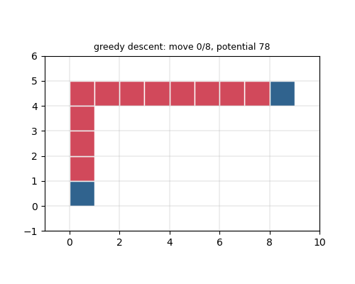
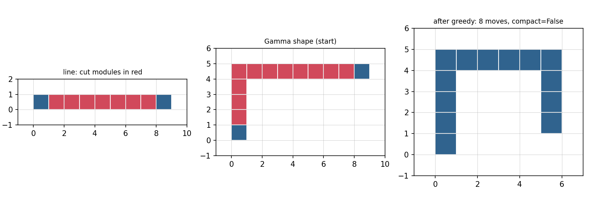

<h1 align="center">Sliding-Squares-Reconfiguration-Lab</h1>

<p align="center">
  A small Python sandbox for the sliding-squares model of modular robots:
  legal moves, cut modules, lower bounds on reconfiguration, and a naive
  heuristic that shows why local strategies get stuck.
</p>

<p align="center">
  
  
  
  
</p>

<p align="center">
  
</p>

<p align="center"><sub>
  Greedy descent on a Gamma shape. Cut modules (the ones that can't move
  without disconnecting the shape) are red. After 8 moves no move lowers the
  potential any more, and the shape still isn't compact.
</sub></p>

---

## What it is

In the sliding-squares model, a modular robot is a set of unit squares on a
grid. One square moves at a time, and the rest of the shape has to stay
connected while it moves. The question is how to turn one shape into another,
and how many moves that takes.

This repo is a sandbox for playing with that model. It has:

- **The move set.** A *slide* along a neighbour, and a *convex transition*
  around a corner. A square can only move if removing it keeps the shape
  edge-connected.
- **Cut modules.** The squares that can't move because the shape would fall
  apart, found with Tarjan's articulation-point algorithm.
- **Two lower bounds.**
  - *Moves:* each move shifts one square by at most 2 in L1 distance, so the
    number of moves is at least half the minimum-cost L1 matching between the
    start and target shapes.
  - *Parallel steps:* if every robot moves at unit speed at the same time,
    the makespan is at least the bottleneck matching value, the smallest
    possible "longest trip" over all matchings.
- **A deliberately naive heuristic.** Greedy descent on a potential (the sum
  of all coordinates), moving towards the origin. It gets stuck in local
  minima, the same way potential-field controllers do. That's the point: it
  shows why the compaction algorithms in the literature add global structure
  to guarantee progress.

## How to run

Python 3.10 or newer. Tested with Python 3.13.5, numpy 2.1.3, scipy 1.15.3
and matplotlib 3.10.0 (Anaconda).

```bash
pip install -r requirements.txt

python sliding_squares.py    # prints the demo, saves demo_toolkit.png
python make_gif.py           # saves media/greedy_gamma.gif
pytest                       # runs the tests
```

Using it from your own code:

```python
from sliding_squares import valid_moves, articulation_points, emd_lower_bound_moves

shape = {(0, 0), (1, 0), (2, 0), (2, 1)}
print(articulation_points(shape))   # {(1, 0), (2, 0)}
print(valid_moves(shape))           # [(from, to, "slide" | "convex"), ...]
```

## Results

Output of `python sliding_squares.py` (about 5 s):

| Experiment | Result |
|---|---|
| Line of 9 squares | potential 36, 7 cut modules (every square except the two ends) |
| Lower bound on moves, line of 9 → 3×3 block | 18 moves |
| Greedy descent on the Gamma shape | 8 moves, potential 78 → 66, then stuck before reaching a compact shape |
| Greedy descent on 300 random connected shapes of 6–14 squares | stuck in 171 of 300 |
| 8 scattered robots → a wall of 8 cells at y = 5 | bottleneck lower bound of 5 grid steps on the parallel makespan |

<p align="center">
  
</p>

<p align="center"><sub>
  Left: in a line, every square except the two ends is a cut module (red).
  Middle: the Gamma shape at the start. Right: where greedy descent stops.
</sub></p>

So greedy descent fails on more than half of the random shapes. Local moves
alone aren't enough. You need some global plan for where the squares should
go.

## Tests

`tests/test_sliding_squares.py` checks that:

- a line of *n* squares has exactly *n* − 2 cut modules, and a 3×3 block has none;
- every move that `valid_moves` returns keeps the shape connected;
- the move lower bound from a line of 9 to a 3×3 block is 18;
- the bottleneck matching is a valid matching, and its value is never larger
  than the longest trip in the minimum-cost matching;
- greedy descent on the Gamma shape keeps the shape connected but stops
  before it's compact.

## Folder structure

```
Sliding-Squares-Reconfiguration-Lab/
├── sliding_squares.py            the toolkit (moves, cut modules, bounds, greedy, plotting, demo)
├── make_gif.py                   animates greedy descent on the Gamma shape
├── tests/
│   └── test_sliding_squares.py   pytest tests
├── media/
│   ├── demo_toolkit.png          demo figure
│   └── greedy_gamma.gif          animation at the top of this page
├── requirements.txt
└── LICENSE
```

## Author

**Arshia Goshtasbi**, MSc student in Control Systems at Iran University of
Science and Technology ([GitHub](https://github.com/Arshiagosh) ·
[LinkedIn](https://www.linkedin.com/in/arshia-goshtasbi/))

## License

[MIT](LICENSE)
